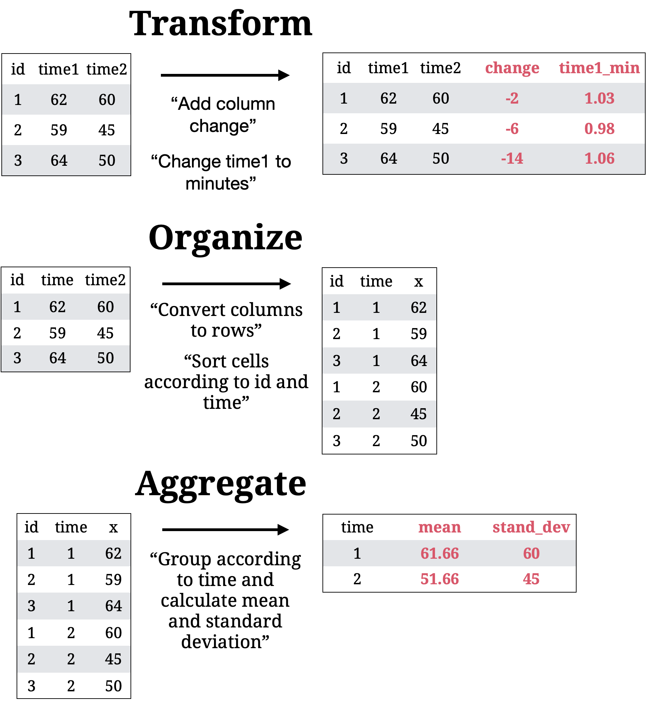
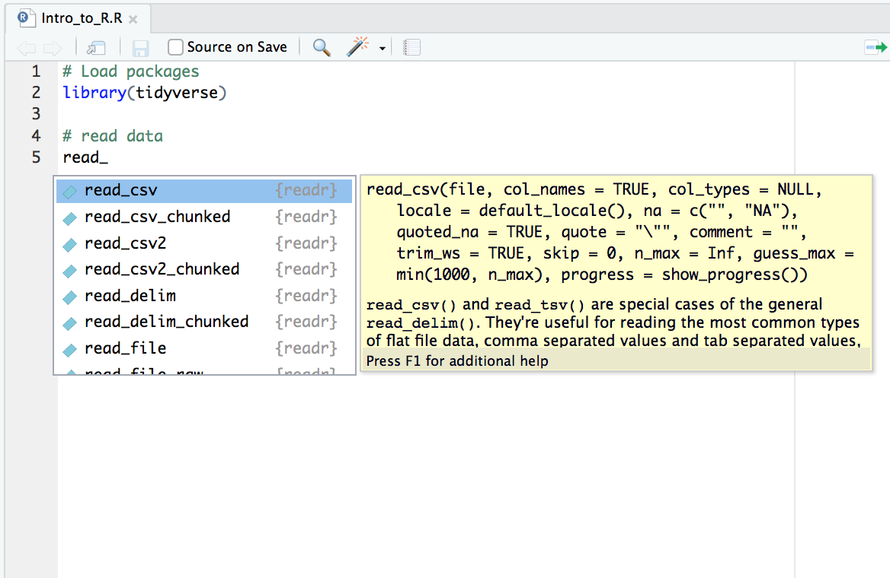

layout: true

<div class="my-footer">
  <span style="text-align:center">
    <span> 
      
    </span>
    <a href="https://therbootcamp.github.io/">
      <span style="padding-left:82px"> 
        <font color="#7E7E7E">
          https://therbootcamp.github.io
        </font>
      </span>
    </a>
    <a href="https://therbootcamp.github.io/">
      <font color="#7E7E7E">
      R for Data Science | October 2022
      </font>
    </a>
    </span>
  </div> 

---

```{r setup, include=FALSE}
options(htmltools.dir.version = FALSE)
# see: https://github.com/yihui/xaringan
# install.packages("xaringan")
# see: 
# https://github.com/yihui/xaringan/wiki
# https://github.com/gnab/remark/wiki/Markdown
options(width=110)
options(digits = 4)
require(tidyverse)
basel = readr::read_csv('1_data/basel.csv')
```

<!---
.pull-left45[

# What is "Wrangling"?

<ul>
  <li class="m1"><span><high>Transform</high>
  <br><br>
  <ul class="level">
    <li><span>Change column names</span></li>
    <li><span>Create new variables</span></li>
  </ul></span></li>
  <li class="m2"><span><high>Organize</high>
  <br><br>
  <ul class="level">
    <li><span>Sort rows</span></li>
    <li><span>Join data sets</span></li>
    <li><span>Transpose data</span></li>
  </ul></span></li>
  <li class="m3"><span><high>Aggregate</high>
  <br><br>
  <ul class="level">
    <li><span>Build groups</span></li>
    <li><span>Calculate statistics</span></li>
  </ul></span></li>
</ul>


]

.pull-right5[
<br>
<p align="center">

</p>

]

--->

# Base R primer

.pull-left4[

<ul>
  <li class="m1"><span>Assignments<br></span></li>
  <ul class="level">
    <li><span>Object <mono><-</mono> function</span></li>
    <li><span><mono><-</mono> creates objects</span></li>
  </ul><br>
  <li class="m2"><span>Functions</span></li>
  <ul class="level">
    <li><span>Everything that happens is a function call</span></li>
    <li><span>Functions have (default) arguments</span></li>
    <li><span>Beware object/argument classes</span></li>
    <li><span>Functions "live" in packages</span></li>
  </ul><br>
</ul>

]

.pull-right5[

<p align="center">
  
</p>


]

---

# Object <mono><-</mono> function

.pull-left4[

<ul>
  <li class="m1"><span>Assignments<br></span></li>
  <ul class="level">
    <li><span><high>Object <mono><-</mono> function</high></span></li>
    <li><span><mono><-</mono> creates objects</span></li>
  </ul><br>
  <li class="m2"><span>Functions</span></li>
  <ul class="level">
    <li><span>Everything that happens is a function call</span></li>
    <li><span>Functions have (default) arguments</span></li>
    <li><span>Beware object/argument classes</span></li>
    <li><span>Functions "live" in packages</span></li>
  </ul><br>
</ul>

]

.pull-right5[

<p align="center">
  
</p>


]

---

# <mono><-</mono> creates objects

.pull-left4[

<ul>
  <li class="m1"><span>Assignments<br></span></li>
  <ul class="level">
    <li><span>Object <mono><-</mono> function</span></li>
    <li><span><high><mono><-</mono> creates objects</high></span></li>
  </ul><br>
  <li class="m2"><span>Functions</span></li>
  <ul class="level">
    <li><span>Everything that happens is a function call</span></li>
    <li><span>Functions have (default) arguments</span></li>
    <li><span>Beware object/argument classes</span></li>
    <li><span>Functions "live" in packages</span></li>
  </ul><br>
</ul>

]

.pull-right5[
```{r}
# an object named score
score <- c(8, 4, 6, 3, 7, 3)

# print the object (aka show its contents)
print(score)

# print the object (aka show its contents)
score

```

]

---

# <mono><-</mono> creates objects

.pull-left4[

<ul>
  <li class="m1"><span>Assignments<br></span></li>
  <ul class="level">
    <li><span>Object <mono><-</mono> function</span></li>
    <li><span><high><mono><-</mono> creates objects</high></span></li>
  </ul><br>
  <li class="m2"><span>Functions</span></li>
  <ul class="level">
    <li><span>Everything that happens is a function call</span></li>
    <li><span>Functions have (default) arguments</span></li>
    <li><span>Beware object/argument classes</span></li>
    <li><span>Functions "live" in packages</span></li>
  </ul><br>
</ul>

]

.pull-right5[
```{r}
# an object named score
score <- c(8, 4, 6, 3, 7, 3)

# mean of score
mean(score)
```

]


---

# Functions 

.pull-left4[
<ul>
  <li class="m1"><span>Assignments<br></span></li>
  <ul class="level">
    <li><span>Object <mono><-</mono> function</span></li>
    <li><span><mono><-</mono> creates objects</span></li>
  </ul><br>
  <li class="m2"><span>Functions</span></li>
  <ul class="level">
    <li><span><high>Everything that happens is a function call</high></span></li>
    <li><span>Functions have (default) arguments</span></li>
    <li><span>Beware object/argument classes</span></li>
    <li><span>Functions "live" in packages</span></li>
  </ul><br>
</ul>
]

.pull-right5[
<p align="center"></p>
]

---

# Functions 

.pull-left4[
<ul>
  <li class="m1"><span>Assignments<br></span></li>
  <ul class="level">
    <li><span>Object <mono><-</mono> function</span></li>
    <li><span><mono><-</mono> creates objects</span></li>
  </ul><br>
  <li class="m2"><span>Functions</span></li>
  <ul class="level">
    <li><span><high>Everything that happens is a function call</high></span></li>
    <li><span>Functions have (default) arguments</span></li>
    <li><span>Beware object/argument classes</span></li>
    <li><span>Functions "live" in packages</span></li>
  </ul><br>
</ul>
]

.pull-right5[

```{r}
# an object named score
score <- c(8, 4, 6, 3, 7, 3)

# print the object (aka show its contents)
score

# mean of score
mean(score)

```
]


---

# Arguments 

.pull-left4[
<ul>
  <li class="m1"><span>Assignments<br></span></li>
  <ul class="level">
    <li><span>Object <mono><-</mono> function</span></li>
    <li><span><mono><-</mono> creates objects</span></li>
  </ul><br>
  <li class="m2"><span>Functions</span></li>
  <ul class="level">
    <li><span>Everything that happens is a function call</span></li>
    <li><span><high>Functions have (default) arguments</high></span></li>
    <li><span>Beware object/argument classes</span></li>
    <li><span>Functions "live" in packages</span></li>
  </ul><br>
</ul>
]

.pull-right5[
```{r, error=TRUE, tidy=T}
# no argument
mean()

# one (necessary) argument
mean(score)

# one (necessary) argument with name
mean(x = score)

# NA added to vector score
mean(x = c(score, NA))
```
]


---

# Arguments 

.pull-left4[
<ul>
  <li class="m1"><span>Assignments<br></span></li>
  <ul class="level">
    <li><span>Object <mono><-</mono> function</span></li>
    <li><span><mono><-</mono> creates objects</span></li>
  </ul><br>
  <li class="m2"><span>Functions</span></li>
  <ul class="level">
    <li><span>Everything that happens is a function call</span></li>
    <li><span><high>Functions have (default) arguments</high></span></li>
    <li><span>Beware object/argument classes</span></li>
    <li><span>Functions "live" in packages</span></li>
  </ul><br>
</ul>
]

.pull-right5[
```{r, error=TRUE,tidy=T}
# no argument
mean()

# one (necessary) argument
mean(score)

# one (necessary) argument with name
mean(x = score)

# change default in additional argument
mean(x = c(score, NA), na.rm = TRUE)

```
]

---

# Classes 

.pull-left4[
<ul>
  <li class="m1"><span>Assignments<br></span></li>
  <ul class="level">
    <li><span>Object <mono><-</mono> function</span></li>
    <li><span><mono><-</mono> creates objects</span></li>
  </ul><br>
  <li class="m2"><span>Functions</span></li>
  <ul class="level">
    <li><span>Everything that happens is a function call</span></li>
    <li><span>Functions have (default) arguments</span></li>
    <li><span><high>Beware object/argument classes</high></span></li>
    <li><span>Functions "live" in packages</span></li>
  </ul><br>
</ul>
]

.pull-right5[

<p align = "center">
<br>
</p>

]


---

# Packages 

.pull-left4[
<ul>
  <li class="m1"><span>Assignments<br></span></li>
  <ul class="level">
    <li><span>Object <mono><-</mono> function</span></li>
    <li><span><mono><-</mono> creates objects</span></li>
  </ul><br>
  <li class="m2"><span>Functions</span></li>
  <ul class="level">
    <li><span>Everything that happens is a function call</span></li>
    <li><span>Functions have (default) arguments</span></li>
    <li><span>Beware object/argument classes</span></li>
    <li><span><high>Functions "live" in packages</high></span></li>
  </ul><br>
</ul>
]

.pull-right5[

<high>Install</high> package <high>once</high> using `install.packages()`

```{r, eval = FALSE}
install.packages("tidyverse")
```
<br2>
<high>Load</high> existing package <high>every time</high> using `library()`

```{r, eval = FALSE}
library(tidyverse)
```

<p align="left"></p>
]


---

# RStudio

.pull-left3[

<ul>
  <li class="m1"><span>RStudio is...</span></li><br>
  <ul class="level">
    <li><span>A high-productivity <high>data science IDE.</high></span></li><br>
    <li><span>The <high>company</high> behind the tidyverse.</span></li><br>
    <li><span>Designed for R tidyverse with <high>good integration</high> for Python, Markdown, or C++.</span></li><br>
  </ul>
</ul>

]

.pull-right6[
<p align="center">

</p>
]

---

# RStudio

.pull-left3[

<ul>
  <li class="m1"><span>RStudio is...</span></li><br>
  <ul class="level">
    <li><span>A high-productivity <high>data science IDE.</high></span></li><br>
    <li><span>The <high>company</high> behind the tidyverse.</span></li><br>
    <li><span>Designed for R tidyverse with <high>good integration</high> for Python, Markdown, or C++.</span></li><br>
  </ul>
</ul>

]

.pull-right5[

<p align = "left">
  
<br><br><br>
Shortcut for <high>send Code to Console</high>:<br><br2><font size = 6>&#8984;/ctrl + &#9166;</font><br><br2><br2>
Shortcut for <high>run Chunk again</high>:<br><br2><font size = 6>  &#8984;/ctrl + &#8997; + p</font>
</p>

]

---

# RStudio

.pull-left3[

<ul>
  <li class="m1"><span>RStudio is...</span></li><br>
  <ul class="level">
    <li><span>A high-productivity <high>data science IDE.</high></span></li><br>
    <li><span>The <high>company</high> behind the tidyverse.</span></li><br>
    <li><span>Designed for R tidyverse with <high>good integration</high> for Python, Markdown, or C++.</span></li><br>
  </ul>
</ul>

]

.pull-right5[

<p align = "center">
  
</p>

]

---

# RStudio

.pull-left3[

<ul>
  <li class="m1"><span>RStudio is...</span></li><br>
  <ul class="level">
    <li><span>A high-productivity <high>data science IDE.</high></span></li><br>
    <li><span>The <high>company</high> behind the tidyverse.</span></li><br>
    <li><span>Designed for R tidyverse with <high>good integration</high> for Python, Markdown, or C++.</span></li><br>
  </ul>
</ul>

]

.pull-right5[

<p align = "left">
  
</p>

]


---

class: middle, center

<h1><a href="">Interactive</a></h1>

