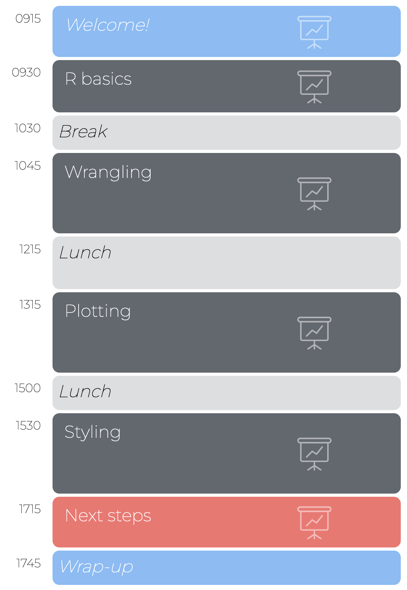
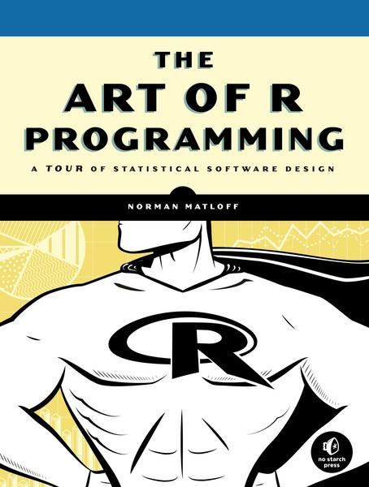
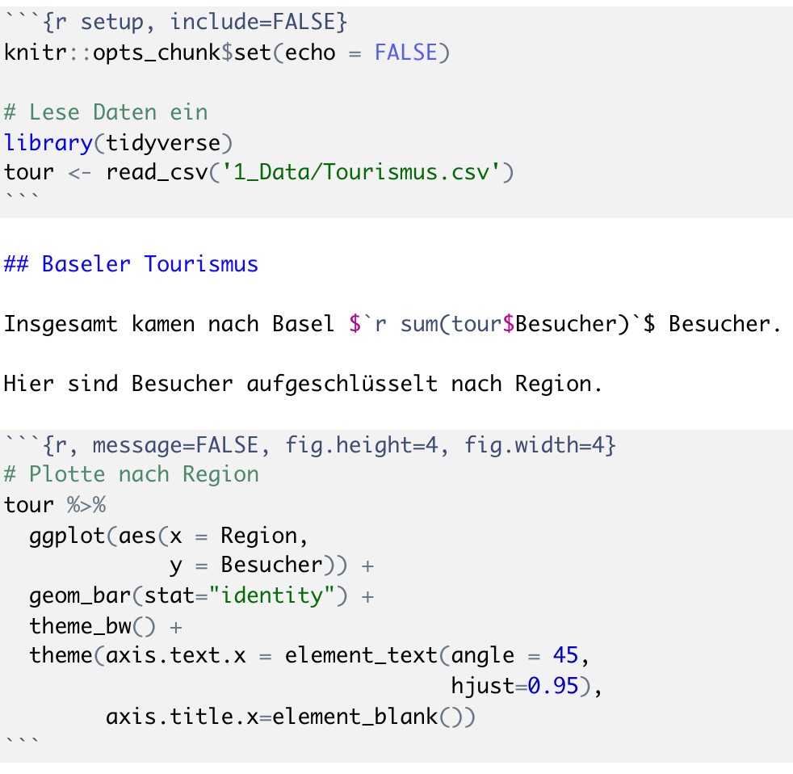
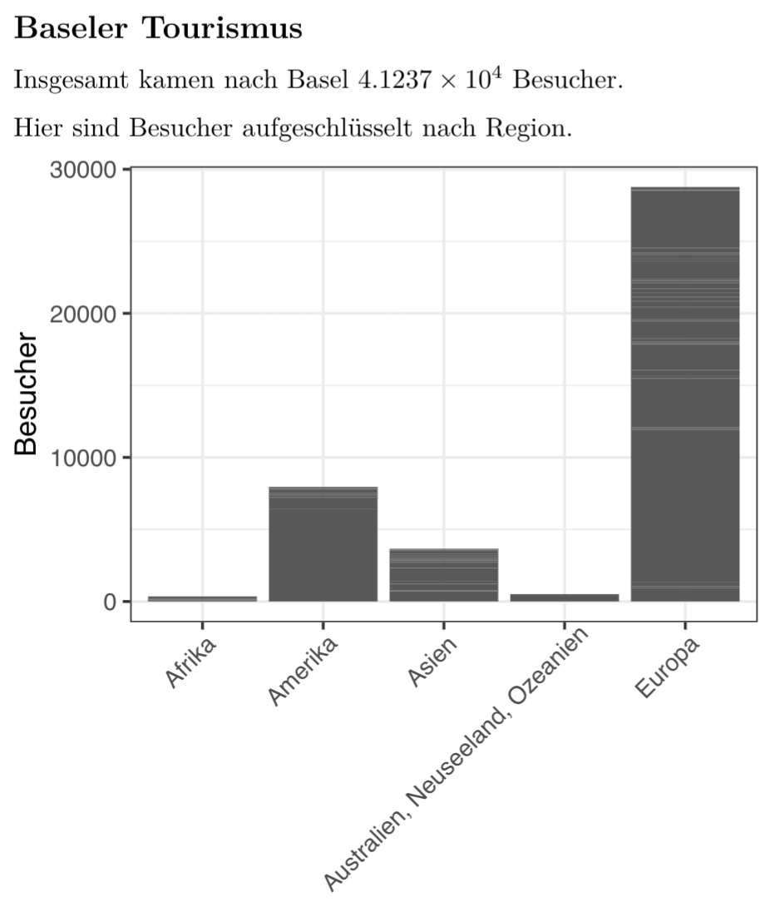
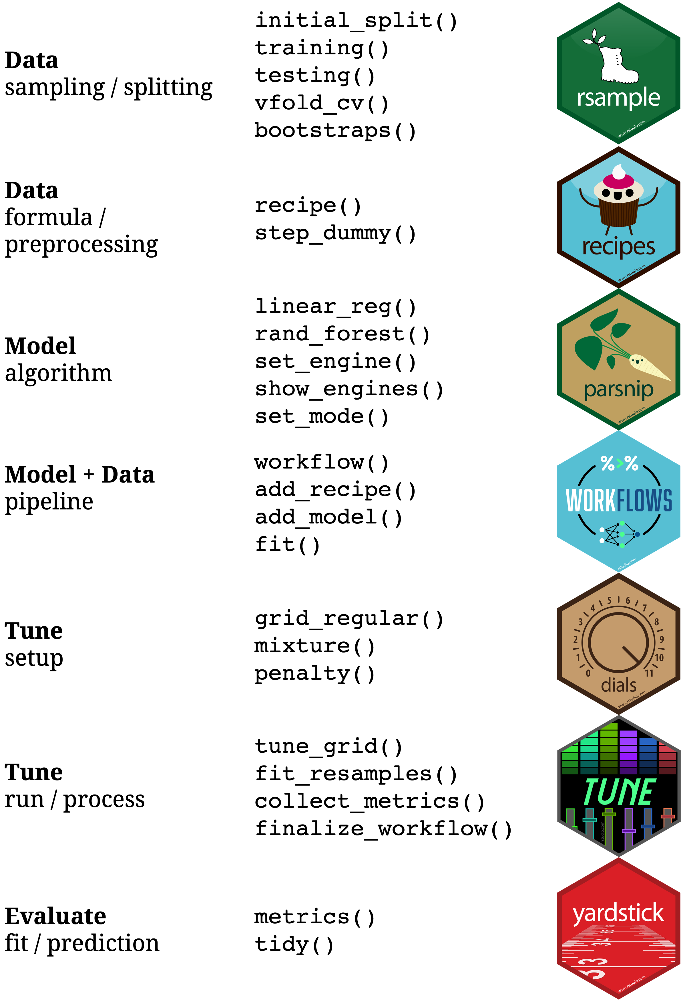

layout: true

<div class="my-footer">
  <span style="text-align:center">
    <span> 
      
    </span>
    <a href="https://therbootcamp.github.io/">
      <span style="padding-left:82px"> 
        <font color="#7E7E7E">
          https://therbootcamp.github.io
        </font>
      </span>
    </a>
    <a href="https://therbootcamp.github.io/">
      <font color="#7E7E7E">
      R for Data Science | June 2022
      </font>
    </a>
    </span>
  </div> 

---

```{r setup, include=FALSE}
# see: https://github.com/yihui/xaringan
# install.packages("xaringan")
# see: 
# https://github.com/yihui/xaringan/wiki
# https://github.com/gnab/remark/wiki/Markdown
options(width=110)
options(digits = 4)
```


.pull-left45[

<br><br><br><br><br>

# Congrats!

You have the basics of R and the tidyverse down!

]

.pull-right4[


]

---

.pull-left5[

# R can do more

<font size = 6>

1. <mono>tidyverse</mono> extended<br>
2. Reporting<br>
3. Statistics<br>
4. Machine learning<br>

</font>


]


.pull-right5[
<br><br>
<p align="center"></p>
]

---

.pull-left3[

# <mono>tidyverse</mono> extended

Many packages build on [<mono>tidyverse</mono>](https://www.tidyverse.org/) principles to offer <high>high-performance tools for many other tasks</high>. 

]

.pull-right65[
<br><br>
<p align="center"></p>

]

---

# Web scraping with <mono>rvest</mono> 

```{r, echo = F, message=F}
options(tibble.print_max = 6, tibble.width=90)
library(xml2) ; library(rvest) ; library(tibble)
```

```{r, message=F}
# load table from Wikipedia
read_html("https://en.wikipedia.org/wiki/R_(programming_language)") %>%
  html_node(xpath = '//*[@id="mw-content-text"]/div[1]/table[2]') %>%
  html_table() %>% as_tibble()
```


---

# Text analysis with <mono>tidytext</mono> 

.pull-left5[

```{r, message=F, eval=F}
library(tidytext) ; library(wordcloud)
library(dplyr) ; library(stringr)

# Count words
counts <- 
  read_html(".../R_(programming_language)") %>%
  html_text() %>%
  tibble() %>%
  unnest_tokens(w, ".") %>%
  filter(!str_detect(w, '[:digit:]')) %>%
  anti_join(stop_words) %>%
  count(word, sort = TRUE) %>%
  top_n(100) 

# Wordcloud
wordcloud(counts$word, 
          counts$n)
  
```

]

.pull-right4[

```{r, message=F, warning=F, echo=F, fig.width=5,fig.height=5,dpi=300}
library(dplyr) ; library(tidytext) ; library(wordcloud) ; library(stringr)

# Count words
counts <- 
  read_html("https://en.wikipedia.org/wiki/R_(programming_language)") %>%
  html_text() %>%
  tibble() %>%
  unnest_tokens(word, ".") %>%
  filter(!str_detect(word, '[:digit:]')) %>%
  anti_join(stop_words %>% bind_rows(tibble(word = 'retrieved', lexicon = ''))) %>%
  count(word, sort = TRUE) %>%
  top_n(100) 

# Wordcloud
par(mar=c(0,0,0,0))
wordcloud(counts$word, 
          counts$n)
  
```

]

---

# Reporting with analysis with <mono>rmarkdown</mono> 

.pull-left45[

<p align="left"></p>
]

.pull-right5[

<p align="center"></p>
]

---

<iframe width="1000" height="600" src="https://vac-lshtm.shinyapps.io/ncov_tracker/?_ga=2.157815026.975657143.1601587486-2064892133.1598629448" frameborder="0" allowfullscreen></iframe>


---

# Statistics


.pull-left45[

```{r, message=F}
library(tidyverse)

# Lade Tourismus Daten
tour <- read_csv('1_Data/Tourismus.csv')
länd <- read_csv('1_Data/Länder.csv')                 

# verbinde Daten
data <- tour %>% 
  inner_join(länd) %>%
  mutate(Nächte = Besucher * Dauer)

# Regressionsanalyse
model = lm(Nächte ~ Bevölkerung + 
                    Dichte + BIP,
           data = data)
```

]

.pull-right45[


```{r, message=F, warning=F}
# Bestimmtheitsmass
summary(model)$r.squared
```


```{r, message=F, warning=F, echo=T, eval=F}
# Koeffizienten
summary(model)$coef[,-2]
```

```{r, message=F, warning=F, echo=F, eval=T}
# Koeffizienten
summary(model)$coef[,-2]
```
]

---

.pull-left45[

# Machine learning

```{r, message=F, eval=F}
library(tidyverse) ; library(rpart)

# Lade Tourismus Daten
tour <- read_csv('1_Data/Tourismus.csv')
länd <- read_csv('1_Data/Länder.csv')                 

# verbinde Daten
data <- tour %>% 
  inner_join(länd) %>%
  mutate(Nächte = Besucher * Dauer)

# Regressionsanalyse
rpart(
  formula = Besucher ~ Bevölkerung + 
                       Dichte + BIP,
  data = data) 
  
```

]

.pull-right45[

<br><br>

```{r, message=F, warning=F, echo=F, fig.width=5,fig.height=5,dpi=300}
library(tidyverse) ; library(rpart)
library(rattle)

# Lade Tourismus Daten
tour <- read_csv('1_Data/Tourismus.csv')
länd <- read_csv('1_Data/Länder.csv')                 

# verbinde Daten
data <- tour %>% 
  inner_join(länd) %>%
  mutate(Nächte = Besucher * Dauer)

# Regressionsanalyse
rpart(
  formula = Besucher ~ Bevölkerung + 
                       Dichte + BIP,
  data = data,
  control = rpart.control(cp = 0)) %>%
  fancyRpartPlot(caption = '')
```

]

---

.pull-left45[

# Machine learning 

<ul>
  <li class="m1"><span><mono>tidymodels</mono> is a new meta-package for tidy ML in R.</span></li>
  <li class="m2"><span>Multiple packages span every important step of ML.</span></li>
</ul>

<br>
<p align = "center">
<br>
<font style="font-size:10px">from <a href="https://www.tidymodels.org/packages/">tidymodels.org</a></font>
</p>

]

.pull-right5[

<p align = "center">
<br>
<br>
</p>

]


---

# Books  

An incomplete list of useful books ordered according to topic and level of expertise.<br><br>

<table width="80%" style="cellspacing:0; cellpadding:0; border:none;">

  <tr>    

  <td> 
  <a href="http://r4ds.had.co.nz/"></a>
  </td>

  <td>
  <a href="https://covers.oreillystatic.com/images/0636920028574/cat.gif"></a>
  </td>

  <td> 
  <a href="https://ggplot2-book.org/"></a>
  </td>

  <td>
  <a href="https://www.springer.com/de/book/9783540799979"></a>
  </td>
  
  <td>
  <a href="https://bookdown.org/ndphillips/YaRrr/"></a>
  </td>
  
  <td>
  <a href="https://www.orellfuessli.ch/shop/home/artikeldetails/ID35367941.html?ProvID=10917736&gclid=Cj0KCQiAg_HhBRDNARIsAGHLV5238Q26gQmFttHRnYGjcAhz4CslStb-3qBegvuZS5gnCpWSLNlQvF0aAgfOEALw_wcB"></a>
  </td>
  
  </tr>
  

  <tr style="background-color:#ffffff">

  <td>
  <a href="http://appliedpredictivemodeling.com/"></a>
  </td>
  
  <td>
  <a href="http://www-bcf.usc.edu/~gareth/ISL/ISLR%20First%20Printing.pdf"></a>
  </td>
  
  <td>
  <a href="https://www.manning.com/books/deep-learning-with-r"></a>
  </td>


  <td>
  <a href="https://csgillespie.github.io/efficientR/"></a>
  </td>

  <td>
  <a href="www.rcpp.org/"></a>
  </td>
  
  
  <td>
  <a href="http://adv-r.had.co.nz/"></a>
  </td>


  </tr>
  
</table>
<br>
  
---
class: center, middle

<table class="tg"  style="cellspacing:0; cellpadding:0; border:none; width=100%">
<tr>
<td>
</img>
</td>
<td>
<font style="font-size:80px;font-family:'Yanone Kaffeesatz'">Thank you!</font>
</td>
</tr>
</table>
