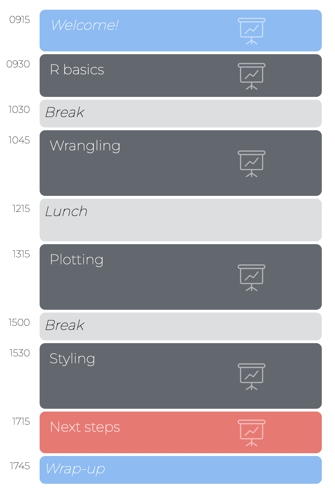
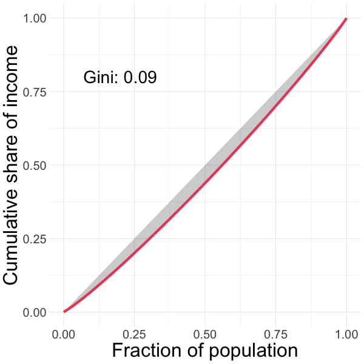

layout: true

<div class="my-footer">
  <span style="text-align:center">
    <span> 
      
    </span>
    <a href="https://therbootcamp.github.io/">
      <span style="padding-left:82px"> 
        <font color="#7E7E7E">
          https://therbootcamp.github.io
        </font>
      </span>
    </a>
    <a href="https://therbootcamp.github.io/">
      <font color="#7E7E7E">
      R for Data Science | October 2022
      </font>
    </a>
    </span>
  </div> 

---


```{r setup, include=FALSE}
options(htmltools.dir.version = FALSE)
options(width=110)
options(digits = 4)

knitr::opts_chunk$set(fig.align = 'center')
```

<!---

.pull-left45[
<br><br><br><br><br>
# Materialien

Klicke auf <high>"....running..."</high> auf unserer Website!

<font style="font-size:28px"><a href="www.therbootcamp.com"><b>www.therbootcamp.com</b></a></font>

]

.pull-right5[

<br><br>
<iframe src="https://therbootcamp.github.io" width="500" height="500"></iframe>

]

--->

.pull-left6[

<br><br><br><br><br>


# Goal


>### The goal of this workshop is to introduce you to R's tools for data wrangling and visualization using packages of the R tidyverse!

]

.pull-right4[

<br><br><br><br>
<p align="center"></p>

]


---

.pull-left45[

<br>
# Schedule 

<ul>
  <li class="m1"><span>Workshop consists of multiple sessions with sessions structured into:</span></li>
  <ul class="level">
    <li><span>Introduction (30-45min)</high></span></li> 
    <li><span>Coding exercises (30-45min)</span></li> 
    <li><span>Q&A (5-15min)</span></li> 
  </ul>
</ul>

]

.pull-right5[
<br><br><br>


]

---

.pull-left3[

# Inequality in Basel

<font style="font-size:28px"><high><i class="far fa-question-circle"></i></high> How has the distribution of income and wealth changed within and between Basel's quarters from 2001 and 2017?</i></font>

<br>

<p align="center">

</p>

]

.pull-right6[

<br>

<p align="center">

</p>

]

---

.pull-left3[

# Inequality in Basel

<font style="font-size:28px"><high><i class="far fa-question-circle"></i></high> How has the distribution of income and wealth changed within and between Basel's quarters from 2001 and 2017?</i></font>

<br>

<p align="center">

</p>

]

.pull-right6[

<br>

<p align="center">

</p>

]


---

.pull-left3[

# Mean, Median, Gini

<ul>
  <li class="m1"><span>Inequality arising from a <high>rich-get-richer</high> dynamic materializes as an increasingly right-skewed income distribution.</span></li><br>
  <li class="m2"><span>This can be detected:</span></li><br>
  <ul class="level">
    <li><span><high>Mean</high> income grows faster than <high>median</high> income.</span></li><br>
    <li><span>The <high>Gini</high> coefficient goes up.</span></li>
  </ul>
</ul>

]


.pull-right65[
<br>
<p align="center">
<br>

</p>
]

---

.pull-left3[

# Mean, Median, Gini

<ul>
  <li class="m1"><span>Inequality arising from a <high>rich-get-richer</high> dynamic materializes as an increasingly right-skewed income distribution.</span></li><br>
  <li class="m2"><span>This can be detected:</span></li><br>
  <ul class="level">
    <li><span><high>Mean</high> income grows faster than <high>median</high> income.</span></li><br>
    <li><span>The <high>Gini</high> coefficient goes up.</span></li>
  </ul>
</ul>

]


.pull-right65[
<br>
<p align="center">
<br>

</p>
]


---

# Introductions

.pull-left35[

<ul>
  <li class="m1"><span>What is your name?</span></li><br>
  <li class="m2"><span>Where are you from?</span></li><br>
  <li class="m3"><span>How much experience do you have with R?</span></li><br>
  <li class="m4"><span>What is your goal behind wanting to learn data visualization with R?</span></li>
</ul>

]

.pull-right55[

<p align="center">

<br>
<font style="font-size:10px">from <a href="https://unsplash.com/photos/3MYvgsH1uK0">unsplash.com</a></font>
</p>

]

---

class: middle, center

<h1><a href="https://therbootcamp.github.io/R4DS_2022Oct/">Schedule</a></h1>


